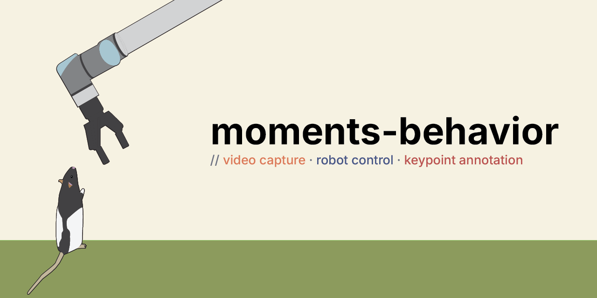

# moments-behavior

Tools for high-throughput, time-synchronized multi-camera recording and labeling, built for behavioral neuroscience research.

## Why we built these

The starting point was a research goal: tracking freely-moving animals in 3D, at high resolution and high frame rate, in a large arena. Covering that volume (and seeing fine details of the animals) takes many cameras. Recording animals for long sessions takes compressed video written to disk in real time. Both demands force the system to scale — every part of the pipeline has to keep up as you add cameras.

That constraint shaped **`orange`**, which uses GPU-accelerated encoding: the GPU handles H.264/HEVC compression, the CPU never becomes the bottleneck, and adding GPUs is the path to handling more cameras or higher resolution. Cameras connect over Ethernet — growing the rig is mostly a wiring problem. Because frames stay on the GPU through the whole pipeline, plugging in deep learning models is easy — a YOLO detector, for instance, can find an animal and its pose live during recording. PTP runs over the same switches and keeps every camera synchronized to sub-frame precision. The same design works for four cameras on one host or many cameras spread across a rig of hosts.

The labeling side, **`red`**, came out of a gap. Once we had synchronized recordings, we couldn't find a tool that played many camera streams in sync smoothly — so we built one with real-time GPU decoding. With calibrated cameras, you label a 3D keypoint by clicking it in any two views — the rest are computed by triangulation. That decouples labeling effort from camera count: more cameras gives you better coverage, not more clicks. In practice it also makes labeling easier — for each frame you can pick the two views where the keypoint is least occluded.

## Projects

### [orange](orange/index.md)

GPU-accelerated multi-camera capture, streaming and recording for Emergent GigE Vision cameras. Single-host or multi-host capture with PTP synchronization and optional real-time YOLO detection.

[Documentation →](orange/index.md) · [Source](https://github.com/moments-behavior/orange)

### [red](red/index.md)

Labeling app for recordings produced by orange.

[Documentation →](red/index.md) · [Source](https://github.com/moments-behavior/red)
