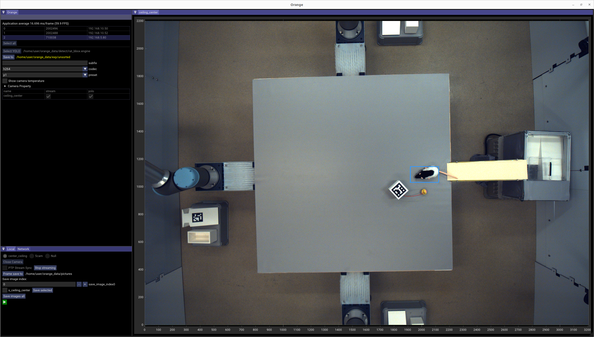
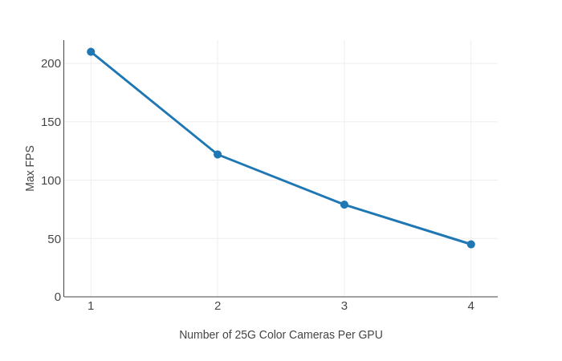

# orange

A high-performance, GPU-accelerated multi-camera capture, streaming and recording application for Emergent GigE Vision cameras.

## Overview

`orange` is built for high-throughput, time-synchronized multi-camera recording. Encoding is GPU-accelerated and scales with the number of GPUs in the host. PTP keeps cameras aligned to sub-frame precision, and a multi-host architecture (one GUI host coordinating any number of headless `cam_server` nodes over ENet) lets a recording rig scale beyond what a single machine can drive — both in camera count and aggregate pixel rate. Optional TensorRT-based YOLO detection runs on the live streams when a model is provided.

[Source on GitHub](https://github.com/moments-behavior/orange) · [Video demo](https://youtu.be/ahceluqBYj8)

## Performance

Encoding performance using a **single** A6000 GPU with a 7MP Emergent camera:

`orange` distributes per-camera encoding across GPUs (assigned by `gpu_id` in each camera's config), so total throughput scales with the number of GPUs in the host — adding GPUs is the recommended path to more cameras or higher resolutions.

## Where to start

- **New install:** [Installation](installation/index.md) — system requirements, dependencies, build.
- **Already built:** [Configuration](configuration.md) → [Local mode](local-mode.md) or [Network mode](network-mode.md).
- **Real-time detection:** [Real-time detection](realtime-detection.md) — train and deploy a YOLOv8 model.
- **Multi-camera sync:** [PTP setup](ptp.md).
