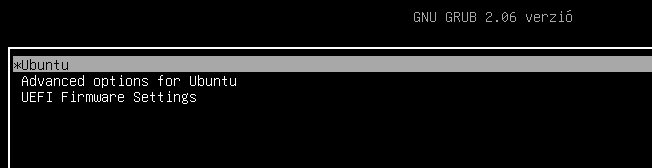
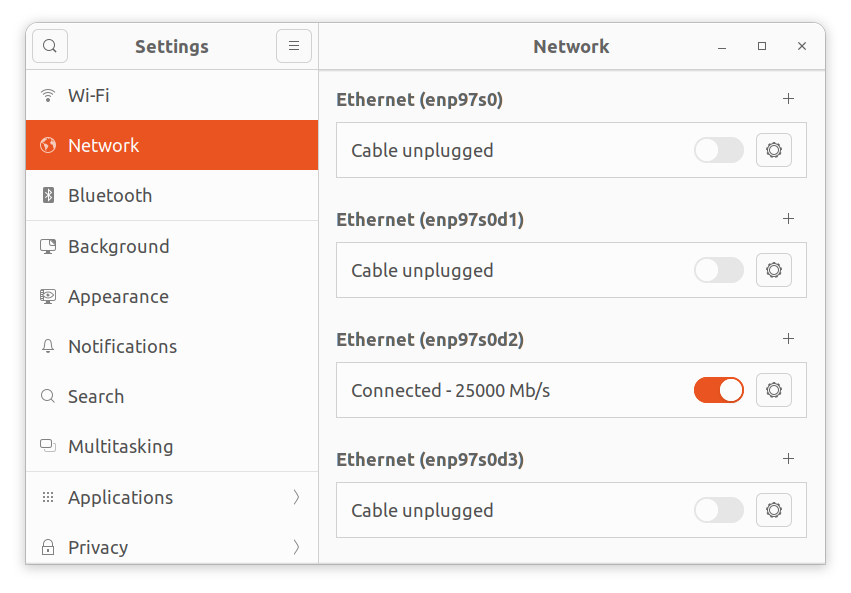
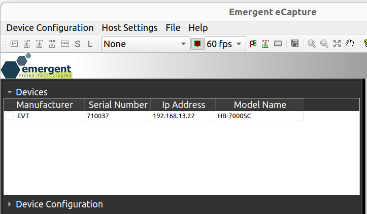
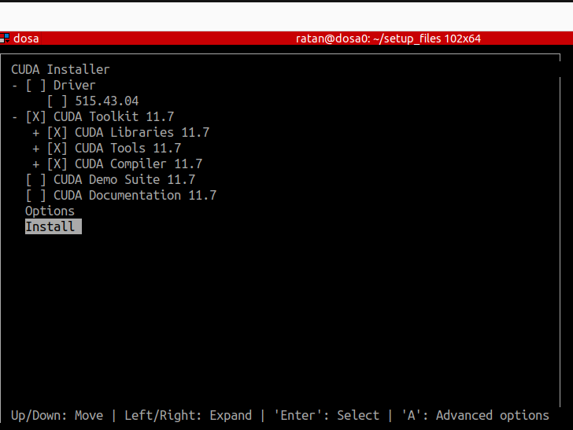

# CUDA & Emergent SDK setup

This page covers setting up Linux, the Emergent SDK, the NVIDIA driver, and CUDA. These are the foundational steps before any of the other dependencies.

Overview of steps:

- [Initial setup before installing Linux](#initial-set-up-before-installing-linux)
- [Install Linux](#install-linux)
- [Post installation — change grub configuration](#post-installation-change-grub-configuration)
- [Update and install some useful software](#update-and-install-some-useful-software)
- [Install Emergent SDK and dependencies](#install-emergent-sdk-and-dependencies)
- [Install NVIDIA driver](#install-nvidia-driver)
- [Install CUDA (depends on NVIDIA driver)](#install-cuda-depends-on-nvidia-driver-installation)

---

## Initial set-up before installing Linux

0. Create a [bootable Linux USB](https://ubuntu.com/tutorials/create-a-usb-stick-on-ubuntu#1-overview) for an [Ubuntu 22.04.4 ISO](https://old-releases.ubuntu.com/releases/22.04/): `ubuntu-22.04.4-desktop-amd64.iso`. The default kernel is 6.5.
    - Alternatively, use [balenaEtcher](https://etcher.balena.io/) to make a bootable Linux USB.
1. Ensure the following on the PC:
    - An existing video card that displays the existing OS or BIOS screen on a monitor — no need to worry about graphics driver for now.
    - At least 3 USB ports that work when you enter BIOS/installation (mouse / keyboard / Linux USB).
    - **Important:** disable any wired/wireless network connections during the install, otherwise it will automatically upgrade to kernel 6.8. As of writing, Emergent eSDK only supports up to kernel 6.5.
2. Plug the bootable Linux USB into one of the active ports and boot up the PC.
3. If the PC does not directly boot into the Linux USB, change `Boot settings` in BIOS:
    - Enter BIOS by pressing F2 or DEL (could be a different key on some motherboards).
    - Go into the BOOT menu and set it to boot from the Linux USB (disable all other boot options).
    - Save and reboot.

??? note "Possible issues you may encounter"

    1. Keyboard/mice not working — not all USB ports may work during installation. Try plugging into different ports.
    2. Screen does not boot into the Linux USB — reformat the USB and recreate, or try a different USB stick.

---

## Install Linux

0. Wait until the Ubuntu desktop is visible and go step-by-step:
1. `Install Ubuntu`.
2. Choose keyboard layout, time zones, etc.
3. Under `Updates and other software`, choose only `Minimal Installation`.
4. Under `Installation type`, choose `Erase Disk and Install Ubuntu`.
5. Choose default disk/partition to install Ubuntu.
6. Set up user accounts. **Do not** run the software upgrade prompted near the end of install.
7. Once installation completes and you log in, open a terminal (`Ctrl + Alt + T`) and check the Ubuntu and kernel versions:
    ```bash
    lsb_release -a
    uname -r
    ```
    Expected output:
    ```
    Distributor ID: Ubuntu
    Description:    Ubuntu 22.04.4 LTS
    Release:        22.04
    Codename:       jammy
    ```
    ```
    6.5.0-18-generic
    ```

---

## Post installation — change grub configuration

This step is needed to boot into secure mode for installing NVIDIA drivers and to detect multiple GPUs.

1. Open and edit the grub menu file (`/etc/default/grub`):
    ```bash
    sudo gedit /etc/default/grub
    ```
2. Set the following options (lines beginning with `#` are comments — keep or remove as needed):
    ```
    # show the menu
    GRUB_TIMEOUT_STYLE=menu
    # set time out for the menu
    GRUB_TIMEOUT=5
    # pci=realloc=off is needed for adding two graphics cards — there may be other arguments in this variable; if so, keep them
    GRUB_CMDLINE_LINUX_DEFAULT="quiet splash pci=realloc=off"
    ```
3. Save the file and update grub:
    ```bash
    sudo update-grub
    ```
4. Reboot and verify you can enter the splash screen.

    ??? note "Expected output"
        

---

## Update and install some useful software

1. Disable automatic updates and upgrades, and only **then** connect to ethernet.
2. Run an update:
    ```bash
    sudo apt-get update
    ```
3. Install required packages:
    ```bash
    sudo apt-get install net-tools pkg-config make gcc libglvnd-dev git curl
    ```
4. Set up SSH client and server:
    ```bash
    sudo apt-get install openssh-client openssh-server
    sudo systemctl enable ssh
    sudo ufw allow ssh
    ```
5. (Optional) Install `grub-customizer` to show only the required kernel if you end up with multiple kernels.
6. Make the following directories for convenience:
    - `/home/$USER/setup_files` — for downloaded drivers and installation files.
    - `/home/$USER/nvidia` — for building dependencies.
    - `/home/$USER/src` — for cloned source repos.

---

## Install Emergent SDK and dependencies

**0. Ensure the Emergent quad-port NIC is plugged into the PCIe slot.**

**1. Download files from the Emergent FTP server:**

- eSDK: download [`eSDK_2_55_02_eCap_2_11_04_Ubuntu_22_04_6_5_0_x64.zip`](https://emergentvisiontec.com/downloads/)
- Rivermax license file (`rivermax.lic`)

**2. Unzip and install the eSDK** (assumes downloads are in `/home/$USER/setup_files`):

```bash
cd /home/$USER/setup_files
unzip eSDK_2_55_02_eCap_2_11_04_Ubuntu_22_04_6_5_0_x64.zip -d emergent
cd emergent
sudo ./install_eSdk.sh -i Mellanox
```

The script downloads and installs the Mellanox NIC driver and dependencies. On success:

```
Emergent eSDK & eCapture have been installed successfully.
```

**3. Acquire a license file from Emergent Vision and copy it to `/opt/mellanox`:**

```bash
sudo cp rivermax.lic /opt/mellanox/rivermax.lic
```

**4. Launch `eCapture`** (you can't acquire frames yet — NIC isn't configured):

```bash
cd /opt/EVT/eCapture
sudo ./eCapture
```

**5. Configure network settings for the NIC.** Under `Settings > Network`, you should see four similarly-named EVT NIC interfaces (`enp97s0` and `enp97s0dX`).

??? note "Screenshot"
    

In the screenshot above, `enp97s0d2` shows as connected because a camera is plugged into that port. Apply the following network settings to each EVT NIC interface you want to use:

| property | value         |
| -------- | ------------- |
| MTU      | 9000          |
| IPv4     | Manual        |
| Address  | 192.168.13.10 |
| Netmask  | 255.255.255.0 |
| Gateway  | 192.168.13.1  |

Convention: keep each interface on a different subnet — e.g. `192.168.10.10`, `192.168.11.10`, `192.168.12.10` for the other three interfaces.

**6. Configure cameras to stream through `eCapture`:**

- Connect camera to the EVT NIC port using a fiber optic cable, then power on.
- Open the eCapture app:
    ```bash
    cd /opt/EVT/eCapture
    sudo ./eCapture
    ```
- If the camera IP is configured properly, it should show up under the `Devices` panel.

    ??? note "Expected output"
        

- If the camera does not show up, force an IP from `Device Configuration → Force ip`:

    | field        | value                                                                                                              |
    | ------------ | ------------------------------------------------------------------------------------------------------------------ |
    | MAC/SN       | the serial number on the camera                                                                                    |
    | IP address   | if the camera is plugged to the NIC port with IP `192.168.13.10`, the camera IP should be `192.168.13.XX` (XX ≠ 10) |
    | Subnet       | 255.255.255.0                                                                                                      |
    | Gateway      | 0.0.0.0                                                                                                            |

- Click `Apply` and wait a few seconds — the camera should appear under `Devices`.
- **Note:** the above sets a temporary IP. To persist after power cycling, use `Device Configuration → IP Configuration`, set `Persistent IP Address`, then `Write Configuration`.
- Test by power-cycling the camera and verify you can acquire frames.

**7. Update camera firmware to 3.70.** Download the firmware from Emergent FTP and move to `/home/$USER/setup_files`. Typical files:

- BIN file: `HB_IMX4xx_3.70.bin` (may differ for your camera — but always a `.bin`)
- XML file: `XML_HB-7000S-C_3_70.zip`

Follow the instructions in the included `Readme.txt`.

---

## Install NVIDIA driver

**0. Download the driver setup file.** Go to [NVIDIA's Linux driver archive](https://www.nvidia.com/en-us/drivers/unix/linux-amd64-display-archive/) and pick a version:

- `535.183.06` for Linux kernel 6.5
- `525.105.17` works well with the A6000 (or a PC with both A16 and A6000)
- `550.90.07` works well with multiple A16

**1. Run the installation file.** Strongly recommended: boot into secure mode first (X driver running causes issues).

```bash
cd /home/$USER/setup_files
chmod +x NVIDIA-Linux-x86_64-535.183.06.run
sudo ./NVIDIA-Linux-x86_64-535.183.06.run
```

In the prompts that appear:

- → `Continue Installation`
- → `Ok` for removing Nouveau
- → `Yes` for creating modprobe file
- → `No` for 32-bit compatibility

If installation fails, check the log:

```bash
cat /var/log/nvidia-installer.log
```

**2. Common errors and fixes:**

- **`gcc` version mismatch.** Install the expected `gcc` version and re-run with the `CC` environment variable:
    ```bash
    sudo apt-get install gcc-12
    sudo CC="/usr/bin/gcc-12" ./NVIDIA-Linux-x86_64-535.183.06.run
    ```
- **Missing dependencies/packages** (e.g. `pkg-config`, `libglvnd`). Install them and re-run; you may need to do this multiple times since the installer only checks one at a time.

If you hit other errors and find a fix, please open a PR to add it here.

**3. Verify driver installation:**

```bash
nvidia-smi
```

This should list the GPUs accessible via the driver.

---

## Install CUDA (depends on NVIDIA driver installation)

**0. Download the installation file.** We use CUDA 12.2 with driver 535.104.05. Other versions are at the [CUDA toolkit archive](https://developer.nvidia.com/cuda-toolkit-archive) — prefer the `runfile (local)` installer.

**1. Run the install file:**

```bash
cd /home/$USER/setup_files
sudo cuda_12.2.2_535.104.05_linux.run
```

Important:

- **Uncheck `Driver`** under the `CUDA Installer` menu — don't reinstall the driver.
- **Check `CUDA Toolkit 12.X`**.
- Start installation with `Install` and follow prompts.

??? note "Install menu"
    

Note the path CUDA installs to (usually `/usr/local/cuda`).

**2. Add to PATH and verify:**

Edit `.bashrc`:

```bash
gedit /home/$USER/.bashrc
```

Add CUDA's path:

```bash
export PATH=/usr/local/cuda/bin:$PATH
export LD_LIBRARY_PATH=/usr/local/cuda/lib64:$LD_LIBRARY_PATH
```

Save, then verify:

```bash
source ~/.bashrc
nvcc --version
```

---

## Enable GPU-Direct

**0. Enable PCIE Above 4G Decoding and Resizable Bar.** In BIOS, enable **PCIE Above 4G Decoding** and **Resizable Bar**. You may need to upgrade the BIOS if these aren't supported.

**1. Load the `nvidia-peer-memory` module.** Activate the init script `start-nvidia-peermem` so the system loads the module on boot:

```bash
sudo update-rc.d start-nvidia-peermem defaults
sudo /etc/init.d/start-nvidia-peermem start
```

Verify:

```bash
lsmod | grep nvidia_peermem
```

Expected:

```
nvidia_peermem         16384  0
```
