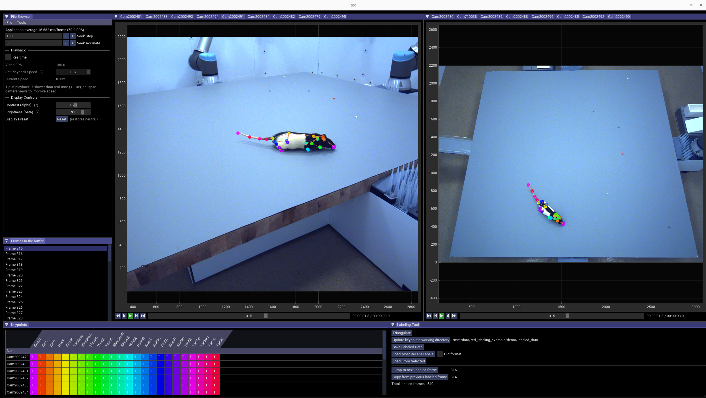

# Labeling 3D keypoints

This page walks the post-recording side of the pipeline — calibration, labeling, training, and inference — using a 10-second sample from our 17-camera arena rig, so you can practice with real data without setting up your own cameras first. The output is a JARVIS-HybridNet 3D pose model for a freely-moving rat.

---

## 1. Prerequisites

- [`red`](red/installation/build.md) built and runnable.
- A Python environment for the JARVIS exporter and trainer (see [JARVIS-HybridNet](https://github.com/JARVIS-MoCap/JARVIS-HybridNet) and [Data export](red/data-export.md) for setup).
- The sample dataset downloaded (next step).

---

## 2. Get the sample data

> *TODO: download URL for the 10-second 17-camera arena sample.*

The sample bundle contains:

- 17 short `.mp4` recordings (one per camera) plus per-camera meta CSVs
- Camera calibration files (`calibration/`) — intrinsics + extrinsics
- A starter `skeleton.json` for the rat keypoint set used in this walkthrough

Layout after unpacking:

```
red_labeling_example/
├── calibration/
│   ├── <serial-1>.yaml
│   ├── ...
├── movies/
│   ├── Cam<serial-1>.mp4
│   └── ...
```

---

## 3. About the calibration

The sample ships with calibration already done — `calibration/` contains intrinsics and extrinsics for all 17 cameras. We use ChArUco board to calibrate the rig. Please refer to this [repo](https://github.com/moments-behavior/multiview_calib) for details. 

---

## 4. Open the recording in red

```bash
cd ~/src/red
./run.sh
```

In the GUI, **File → Open Video(s)** → navigate to the `red_labeling_example/movies` folder, select all cameras, and click **OK**.


Once loaded, you can watch the synchronized recorded videos in `red`. Note: it might take some time to initialize multiple large videos.

To start labeling, in the GUI choose **File → Create Project**. In this dialog, name the labeling project, select a save path, and pick the **Rat24** skeleton preset. (`red` also has a skeleton creator under **Tools → Skeleton Creator** that you can use to define your own `skeleton.json`; load it by switching the dropdown from **Preset** to **File**.)

Click **Browse** to navigate to the calibration folder and select it. For instance:


Click **Create Project**. It creates a folder with the Project Name inside Full Path — in this example, `/mnt/data/red_labeling_example/demo/` — with the following layout:

```
red_labeling_example/demo/
├── labeled_data
└── project.redproj
```

`project.redproj` is a JSON file containing the project's metadata (calibration folder, skeleton, etc.). Double-clicking it opens the project and reloads the videos and most recently labeled frames — provided `red` was installed via the [desktop launcher](red/installation/build.md#optional-install-a-desktop-launcher).

---

## 5. Label 3D rat poses

Pick frames spaced across the 10-second clip. For each frame, click each keypoint in **at least 2 camera views**. `red` triangulates the 3D position automatically and projects it back into all 17 views.




With 17 cameras you don't need to label more than 2–3 views per keypoint — pick the views where the rat is least occluded for that frame.

For a detailed walkthrough of labeling 24 keypoints on a rat, watch the video demo:

<div style="position: relative; padding-bottom: 56.25%; height: 0;">
  <iframe src="https://www.youtube.com/embed/9eOJaadE1Nc"
    style="position: absolute; top: 0; left: 0; width: 100%; height: 100%;"
    frameborder="0" allowfullscreen></iframe>
</div>


---

## 6. Export for JARVIS

Use the JARVIS exporter from `red`'s `data_exporter/`. Full reference: [Data export](red/data-export.md).

```bash
cd ~/src/red/data_exporter
conda activate red_exporter
python red3d2jarvis.py \
    -p /path/to/red_labeling_example/demo \
    -o /path/to/rat_jarvis_dataset \
    -m 60
```

`-m` is the bounding-box margin in pixels.

Once generated, you can check the dataset with:

```bash
cd ~/src/red/data_exporter
conda activate red_exporter
python check_jarvis_dataset.py \
    -i /path/to/rat_jarvis_dataset
```

You can readjust the margin from the previous step to make sure the bounding box encloses the rat tightly.

---

## 7. Train a JARVIS HybridNet model

Follow the [JARVIS-HybridNet](https://github.com/JARVIS-MoCap/JARVIS-HybridNet) training docs for the basic flow. JARVIS's built-in heuristics for sigma, grid, cube size, and CenterDetect input size assume "whole-animal" scale and are often wrong for fine keypoint work. `red3d2jarvis.py` prints data-driven suggestions instead:

```
=== JARVIS training-config suggestions ===
3D label extent (max axis span per frame, mm): median=341, p95=396, p99=400, max=402
HYBRIDNET.ROI_CUBE_SIZE (1.20 x max axis span, no dropped frames):
  for GRID_SPACING=4: 496 mm
  for GRID_SPACING=6: 504 mm
  for GRID_SPACING=8: 512 mm

Closest-pair distribution (median across frames):
  #1:  18.9 mm  (AnkleR <-> FootR)
  #2:  19.7 mm  (AnkleL <-> FootL)
  #3:  23.9 mm  (Neck <-> ShoulderL)
  #4:  24.3 mm  (EarR <-> ShoulderR)
  #5:  24.5 mm  (Neck <-> ShoulderR)
HYBRIDNET.GT_SIGMA_MM:  9 mm, ~13.9px  (closest-pair / 2)
HYBRIDNET.GRID_SPACING: 4 mm, ~6.2px  (sigma / 2; finer = better localization, ~8x memory per halving)
CENTERDETECT.IMAGE_SIZE: 448  (smallest animal at CD input = 35 px; >= 32 px reliable. JARVIS uses non-uniform stretch resize, so this checks the worst-squashed axis.)
```

What each value means:

- **`HYBRIDNET.GT_SIGMA_MM`** — Gaussian width for the 3D keypoint heatmap. Half the closest-pair distance, so the network can distinguish adjacent keypoints. Override upward only if training converges too slowly.
- **`HYBRIDNET.GRID_SPACING`** — voxel resolution. Sigma/2, so the Gaussian is well-sampled. Halving multiplies HybridNet memory by ~8×; bump back up if GPU memory is tight.
- **`HYBRIDNET.ROI_CUBE_SIZE`** — 3D volume the model predicts in. Pick the row matching your `GRID_SPACING` (must be divisible by `4 × GRID_SPACING`). JARVIS silently drops any training frame whose 3D extent exceeds the cube; our patched JARVIS prints a warning instead.
- **`CENTERDETECT.IMAGE_SIZE`** — input resolution for CenterDetect's 2D animal-localization stage. Smallest multiple-of-64 that keeps the smallest animal above 32 px on the worst-squashed axis (JARVIS uses non-uniform stretch resize). Independent of `KEYPOINTDETECT.BOUNDING_BOX_SIZE`.

> **WARN block:** if your skeleton has any keypoint pair only a few mm apart, the literal sigma/grid suggestion can demand a 1–2 mm voxel grid (tens of millions of voxels in a typical cube) that won't fit on most GPUs. When the suggested grid drops below 3 mm, the exporter prints a `WARN` with practical alternatives (use coarser values, drop one of the close pair, or merge them).

### Reference config

Tested for the 17-camera Rat22 example (200 labeled frames, train/val/test = 162/18/20). `KEYPOINT_NAMES` and `SKELETON` sections are omitted — JARVIS auto-generates them from your dataset when the project is created.

```yaml
DATALOADER_NUM_WORKERS: 8
DATASET:
  DATASET_2D: /path/to/rat_jarvis_dataset
  DATASET_3D: /path/to/rat_jarvis_dataset
CENTERDETECT:
  MODEL_SIZE: medium
  BATCH_SIZE: 4
  MAX_LEARNING_RATE: 0.003
  NUM_EPOCHS: 80
  IMAGE_SIZE: 448
  VAL_INTERVAL: 5
  CHECKPOINT_SAVE_INTERVAL: 10
KEYPOINTDETECT:
  MODEL_SIZE: medium
  BATCH_SIZE: 4
  MAX_LEARNING_RATE: 0.003
  NUM_EPOCHS: 100
  BOUNDING_BOX_SIZE: 1216
  NUM_JOINTS: 22
  VAL_INTERVAL: 5
  CHECKPOINT_SAVE_INTERVAL: 10
HYBRIDNET:
  BATCH_SIZE: 1
  MAX_LEARNING_RATE: 0.001
  NUM_EPOCHS: 100
  NUM_CAMERAS: 17
  ROI_CUBE_SIZE: 512
  GRID_SPACING: 4
  GT_SIGMA_MM: 8.0
  VAL_INTERVAL: 5
  CHECKPOINT_SAVE_INTERVAL: 10
```

---

## 8. Run JARVIS inference and view results back in red

Run JARVIS-HybridNet inference on the recorded videos with its own inference scripts.

To visualize the predictions in `red`, convert them back with `jarvis2red3d.py`:

```bash
python jarvis2red3d.py \
    -i /path/to/predictions_3D_folder/ \
    -p /path/to/red_labeling_example/demo
```

The converted predictions land in `<project>/predictions/` (e.g. `red_labeling_example/demo/predictions/`). Open the project in `red`, use **Load From Selected** to load the predictions, then scrub through the predicted poses across all 17 views — useful for spot-checking and finding error frames to relabel.

A confidence filter is on by default (drops predictions below 0.7 confidence and z > 500 mm). Disable with `--filter=0`.

---

## What's next

- **Iterating:** relabel error frames found in step 8, retrain, repeat.
- **Recording your own data:** see the [orange docs](orange/index.md) for setting up cameras, PTP, and multi-host capture.
- **Different downstream pipelines:** see the YOLO pose option in [Data export](red/data-export.md).
- **Adding YOLO real-time detection in orange:** see [Real-time detection](orange/realtime-detection.md).
